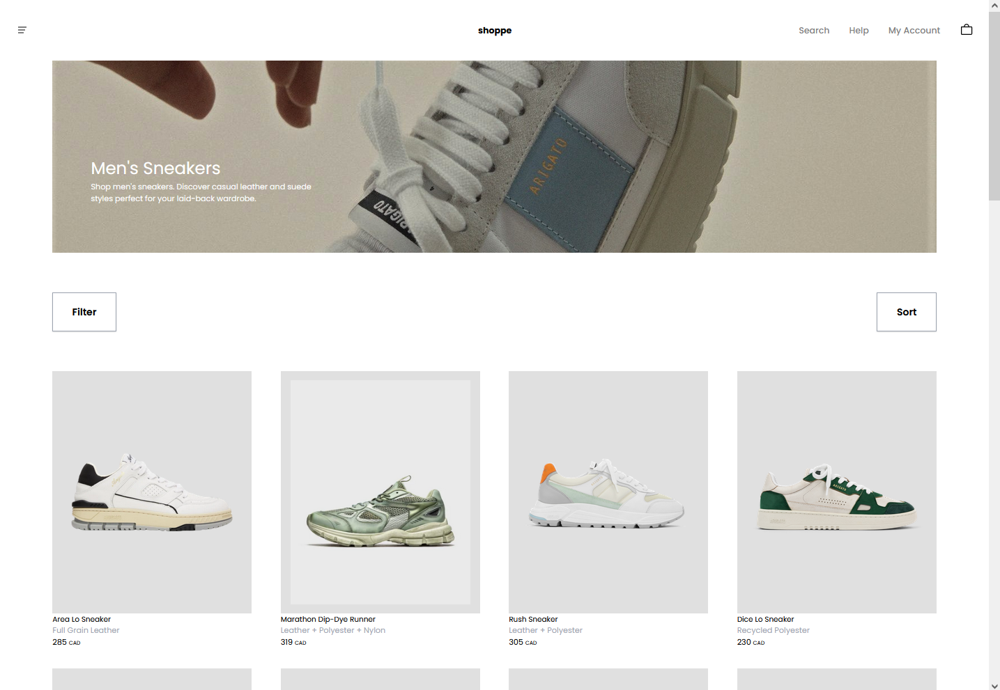
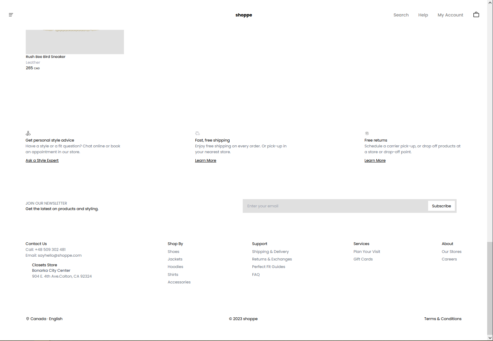

# Shoppe - An Online Shoe Retailer!

Introducing a single-page web app inspired by captivating designs found on Dribbble. With meticulous attention to detail, I recreated these designs into a fully functional React application. Leveraging the simplicity and responsiveness of Tailwind CSS, I ensured that every element reflects the original design's aesthetic appeal. JavaScript was used to implement seamless interactions and dynamic features. For data storage, a simulated database hosted on GitHub provides the app's full functionality.

## Demo

https://shoppe.jacobmutton.tech

## Screenshots




## Run Locally

Clone the project

```bash
  git clone https://github.com/jmutton2/shoppe
```

Go to the project directory

```bash
  cd shoppe
```

Install dependencies

```bash
  npm install
```

Start the app

```bash
  npm run start
```
